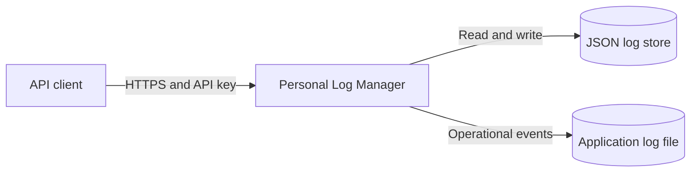
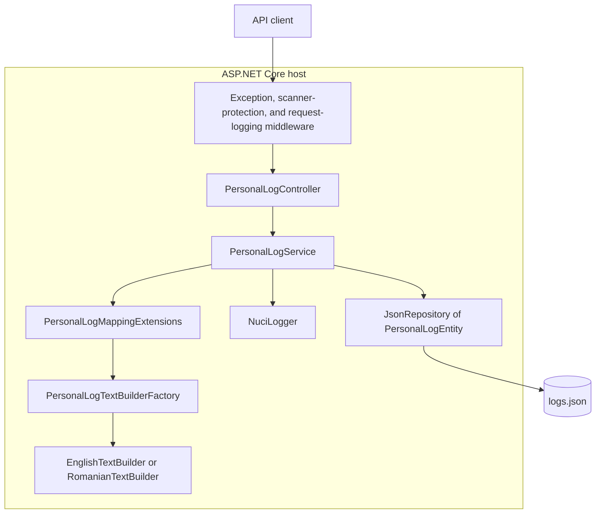
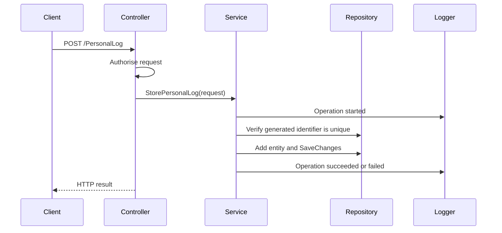
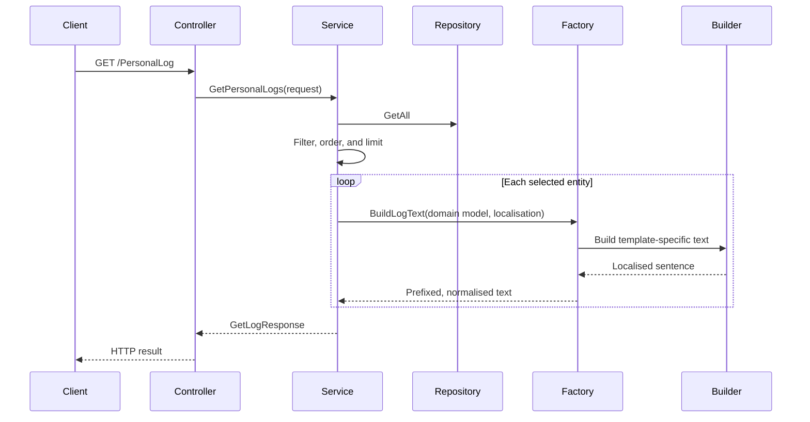

# Personal Log Manager Architecture

## Overview

Personal Log Manager is a single-process ASP.NET Core REST API that stores personal activity logs in a JSON file and renders those logs as localised natural-language text.

The solution is a layered modular monolith. Its principal runtime boundaries are:
- the HTTP API, which receives and authorises requests
- the application service, which coordinates log operations
- the text-building domain, which converts structured logs into localised text
- the data-access adapter, which persists entities through a file repository
- cross-cutting middleware and logging supplied by the Nuci libraries

The application targets .NET 10 and is deployed as one ASP.NET Core process. It does not contain a separate database server, message broker, background worker, or frontend application.

## System Context



Clients submit structured log data and retrieve either structured records or localised text. Every controller action uses the configured API key authorisation policy. The API persists its primary state at the path configured by `dataStoreSettings.logStorePath` and emits operational logs through NuciLog.

## Runtime Components



### Hosting And Composition

[Program.cs](PersonalLogManager/Program.cs) constructs the default ASP.NET Core host and delegates application composition to [Startup.cs](PersonalLogManager/Startup.cs).

`Startup` is responsible for:
- registering controllers and the permitted local CORS origins
- binding configuration and registering application services
- creating the JSON store directory and an empty `[]` store when they do not exist
- composing the HTTP middleware pipeline
- mapping attribute-routed controllers

[ServiceCollectionExtensions.cs](PersonalLogManager/ServiceCollectionExtensions.cs) is the dependency-injection composition root. The configuration objects, repository, application service, text-builder factory, text utilities, and logger are registered as singletons.

### API Layer

[PersonalLogController.cs](PersonalLogManager/Api/Controllers/PersonalLogController.cs) exposes the `/PersonalLog` resource:

| Method | Route | Service Operation |
| --- | --- | --- |
| `POST` | `/PersonalLog` | Store a log |
| `GET` | `/PersonalLog` | Query and render logs |
| `GET` | `/PersonalLog/{id}` | Retrieve one structured log |
| `PUT` | `/PersonalLog/{id}` | Update a log |
| `DELETE` | `/PersonalLog/{id}` | Delete a log |

Request and response DTOs reside in [Api/Models](PersonalLogManager/Api/Models). The controller contains no persistence or text-building logic. It assigns route identifiers to command DTOs where necessary, then delegates execution to `IPersonalLogService` through `NuciApiController.ProcessRequest`.

`ProcessRequest` receives an API-key policy constructed from `SecuritySettings.ApiKey`. Consequently, authorisation remains at the transport boundary while business operations remain in the service layer.

### Application Service

[IPersonalLogService.cs](PersonalLogManager/Service/IPersonalLogService.cs) defines the use-case boundary. [PersonalLogService.cs](PersonalLogManager/Service/PersonalLogService.cs) implements all five API operations and coordinates the repository, text-builder factory, and logger.

The service owns:
- generation of identifiers in the `L#########` format
- exact or regular-expression filtering of date, time, template, and data values
- result ordering and count limitation
- partial updates and data-dictionary merging
- created and updated UTC timestamps
- repository mutation and `SaveChanges` calls
- operation lifecycle logging
- conversion of queried entities into localised text

The service catches operational exceptions only to record failure context, then rethrows them for the exception middleware to translate at the HTTP boundary.

### Domain And Text Building

[PersonalLog.cs](PersonalLogManager/Service/Models/PersonalLog.cs) is the typed model used by the text-building domain. It represents dates and times with `DateOnly` and `TimeOnly`, and templates with `PersonalLogTemplate`.

[PersonalLogMappingExtensions.cs](PersonalLogManager/Service/Mapping/PersonalLogMappingExtensions.cs) converts between the string-based persistence entity and this typed model. List queries use this conversion immediately before rendering text. Single-record responses return persisted values directly through their response DTO.

[PersonalLogTextBuilderFactory.cs](PersonalLogManager/Service/TextBuilding/PersonalLogTextBuilderFactory.cs) coordinates rendering:
1. It creates the date, time, and time-zone prefix.
2. It selects `RomanianTextBuilder` for `ro`, `ro-RO`, or `ro-MD`; every other value uses `EnglishTextBuilder`.
3. It derives a method name in the form `Build{Template}LogText`.
4. It invokes that method on the selected builder.
5. It normalises the resulting sentence.

[PersonalLogTextBuilderBase.cs](PersonalLogManager/Service/TextBuilding/PersonalLogTextBuilderBase.cs) contains shared extraction, deobfuscation, formatting, pluralisation, and mapping helpers. The concrete builders in [TextBuilding/Localisation](PersonalLogManager/Service/TextBuilding/Localisation) provide language-specific template sentences and vocabulary.

The reflection-based method convention is a runtime contract: every `PersonalLogTemplate` intended for rendering requires a corresponding public method on each supported language builder.

### Persistence Layer

[PersonalLogEntity.cs](PersonalLogManager/DataAccess/DataObjects/PersonalLogEntity.cs) is the persistence representation. It stores date, time, time zone, template, creation timestamp, update timestamp, and arbitrary key-value data as JSON-compatible values. Its identifier is inherited from NuciDAL's `EntityBase`.

The application depends on `IFileRepository<PersonalLogEntity>`, while dependency injection supplies NuciDAL's `JsonRepository<PersonalLogEntity>`. The configured repository is therefore replaceable at the composition root without altering the controller or service contracts.

The default store is [logs.json](PersonalLogManager/Data/logs.json). Startup creates the file when absent, but schema migration and data repair are not application concerns. Values required for typed text rendering must remain parseable by the mapping layer.

## Request Flows

### Store A Log



The service generates a random nine-digit identifier, persists the request data with an ISO 8601 UTC creation timestamp, and commits the repository.

### Query Logs



Date, time, and template filters are anchored regular expressions. Data values use the same anchored matching with case-insensitive comparison. Results are ordered by date descending, time descending, template ascending, and creation timestamp ascending before the requested count is applied.

### Retrieve, Update, Or Delete A Log

For identifier-based operations, the controller obtains the identifier from the route. Retrieval returns a structured DTO. Updates apply only non-null scalar values, merge supplied data keys into the existing dictionary, assign an ISO 8601 UTC update timestamp, and commit. Deletion removes the entity and commits.

## Cross-Cutting Concerns

### Security

- Each action supplies API-key authorisation to `NuciApiController.ProcessRequest`.
- The API key is bound from `securitySettings.apiKey`; a real secret must be supplied through deployment configuration and must not be committed.
- Scanner protection executes before routing.
- HTTPS redirection is active.
- CORS permits only the explicit localhost origins registered in `Startup`.

### Error Handling

NuciAPI exception-handling middleware is the outermost application middleware. The service logs exceptions and rethrows them, preserving one HTTP-level error translation boundary. Text-rendering failures are wrapped with the identifier of the last log being rendered.

### Observability

NuciAPI request-logging middleware records HTTP activity. `PersonalLogService` emits started, successful, and failed operation events through `ILogger`, including contextual fields such as identifier, date, template, localisation, and count. NuciLog configuration determines whether those events are written to `logfile.log`.

### Configuration

[appsettings.json](PersonalLogManager/appsettings.json) defines three configuration sections:

| Section | Purpose |
| --- | --- |
| `dataStoreSettings` | JSON repository path |
| `securitySettings` | API-key authorisation secret |
| `nuciLoggerSettings` | NuciLog destinations and options |

ASP.NET Core's default configuration pipeline permits environment-specific files, environment variables, and command-line arguments to override these values.

## Dependency Direction

Dependencies point from transport and composition towards stable service abstractions:

```text
ASP.NET Core host
  -> API controller and DTOs
    -> IPersonalLogService
      -> repository abstraction
      -> text-builder factory abstraction
      -> logger abstraction
        -> persistence entities, domain models, and localised builders
```

The service currently accepts API DTOs directly, so the API and application layers share command and query models. Persistence remains behind `IFileRepository`, and text rendering remains behind `IPersonalLogTextBuilderFactory`.

## External Dependencies

The principal package responsibilities are:
- ASP.NET Core: hosting, dependency injection, configuration, middleware, routing, and controllers
- NuciAPI: controller request processing, API-key authorisation, scanner protection, exception handling, and request logging
- NuciDAL: file-repository abstraction, entity base, and JSON repository
- NuciLog: structured operation logging
- NuciText: sentence normalisation and value deobfuscation during rendering

Package versions are defined in [PersonalLogManager.csproj](PersonalLogManager/PersonalLogManager.csproj).

## Testing Strategy

The unit-test project mirrors the service and text-building structure. It verifies service orchestration, shared text-builder helpers, factory selection and formatting, and English and Romanian template rendering. These tests protect the application's most variable logic without requiring an HTTP host.

The present repository does not include a dedicated integration-test suite for controller routing, middleware, authorisation, or the concrete JSON repository. Changes at those boundaries merit focused integration tests because unit tests with abstractions do not verify middleware order, serialisation, filesystem semantics, or deployed configuration.

## Extension Points

### Add A Log Template

1. Add the value to `PersonalLogTemplate`.
2. Add `Build{Template}LogText` to both localised builders.
3. Reuse or extend shared helpers in `PersonalLogTextBuilderBase`.
4. Add English, Romanian, and factory tests for the template.

Because dispatch uses reflection, a missing or incorrectly named method compiles but fails when that template is rendered.

### Add A Localisation

1. Implement a language-specific builder derived from `PersonalLogTextBuilderBase`.
2. Extend factory selection with the accepted locale codes.
3. Add tests for locale selection, shared formatting, and every supported template.

### Replace Persistence

Implement or adapt `IFileRepository<PersonalLogEntity>` and revise its dependency-injection registration. The service expects identifier lookup, enumeration, mutation, and explicit `SaveChanges` semantics.

## Operational Characteristics And Constraints

- Persistence is file-based and optimised for a compact personal data set rather than multi-instance or high-volume deployment.
- Query filtering and ordering occur in application memory after `GetAll`, so cost increases with the total record count.
- The application layer does not define cross-process locking or transactional recovery. Any guarantees in those areas depend on NuciDAL's `JsonRepository` implementation.
- All principal services are singletons. Their implementations and replacements must therefore remain safe for concurrent request access.
- Localised rendering relies on reflection and strict parsing of persisted date, timestamp, and template values, so malformed historical records can cause query-time failures.
- The JSON file and application log can contain sensitive personal information. Deployments must restrict filesystem access, protect backups, and inject secrets through secure configuration.

These constraints are appropriate for the current single-user, file-backed scope. A transition to multiple instances or substantially larger data volumes would require a transactional persistence provider, indexed server-side queries, concurrency controls, and integration coverage for the new adapter.