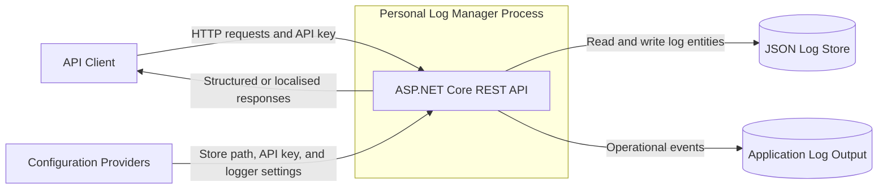
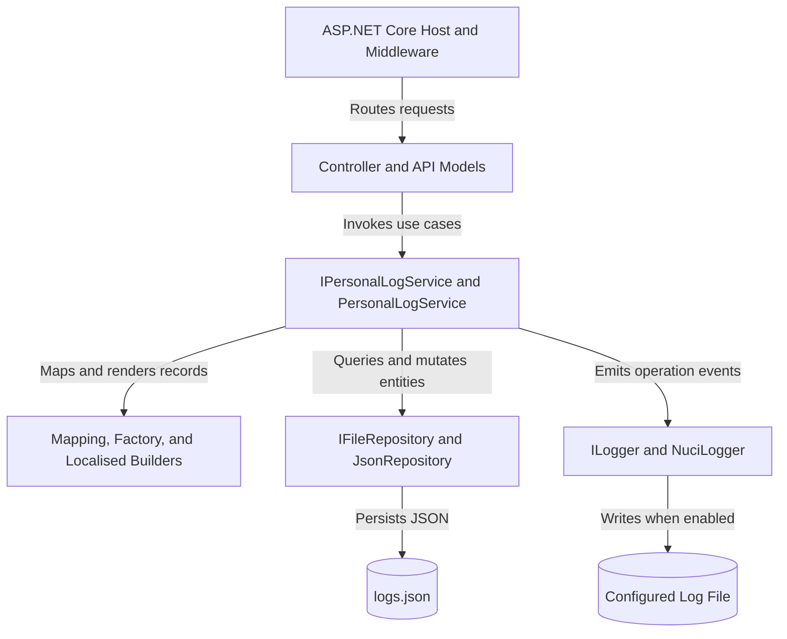
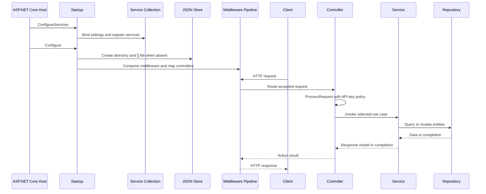
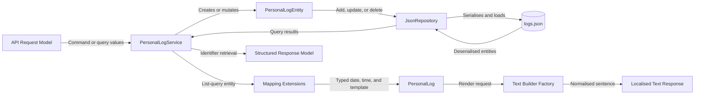
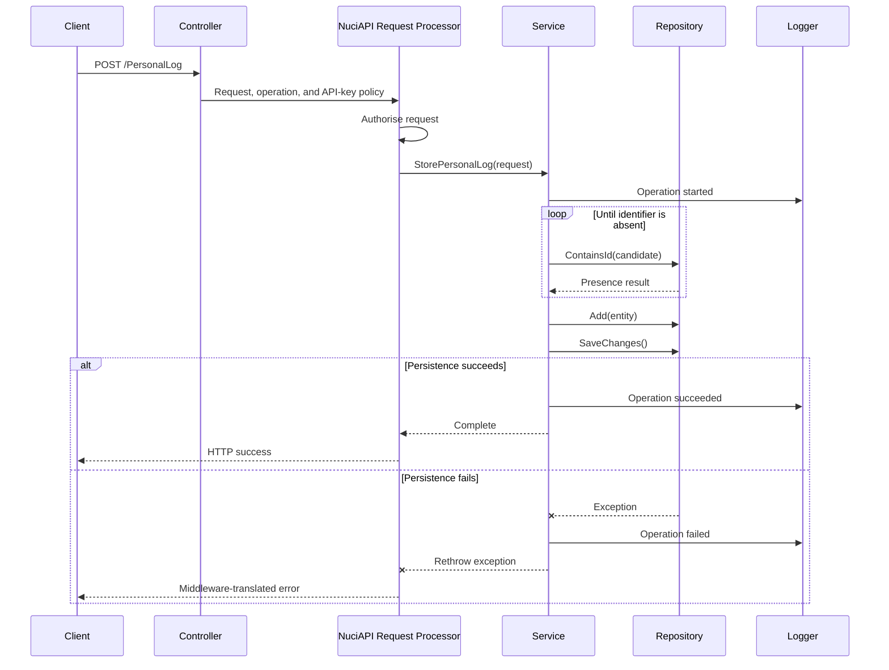
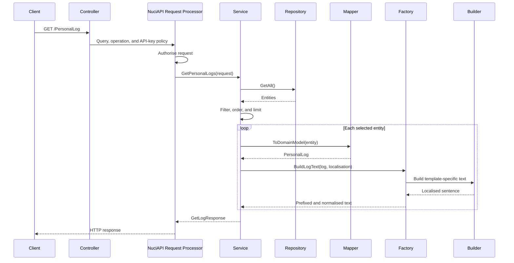
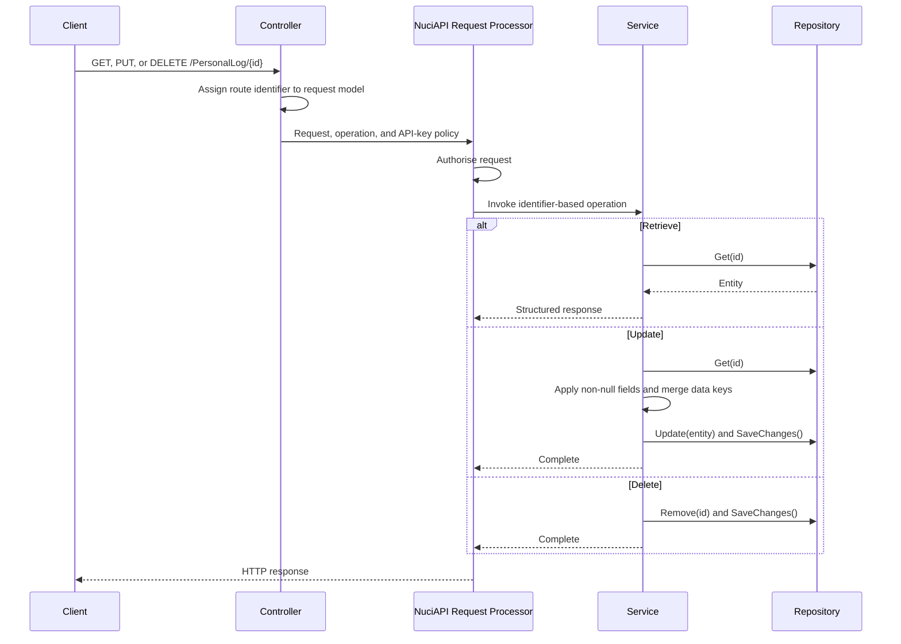
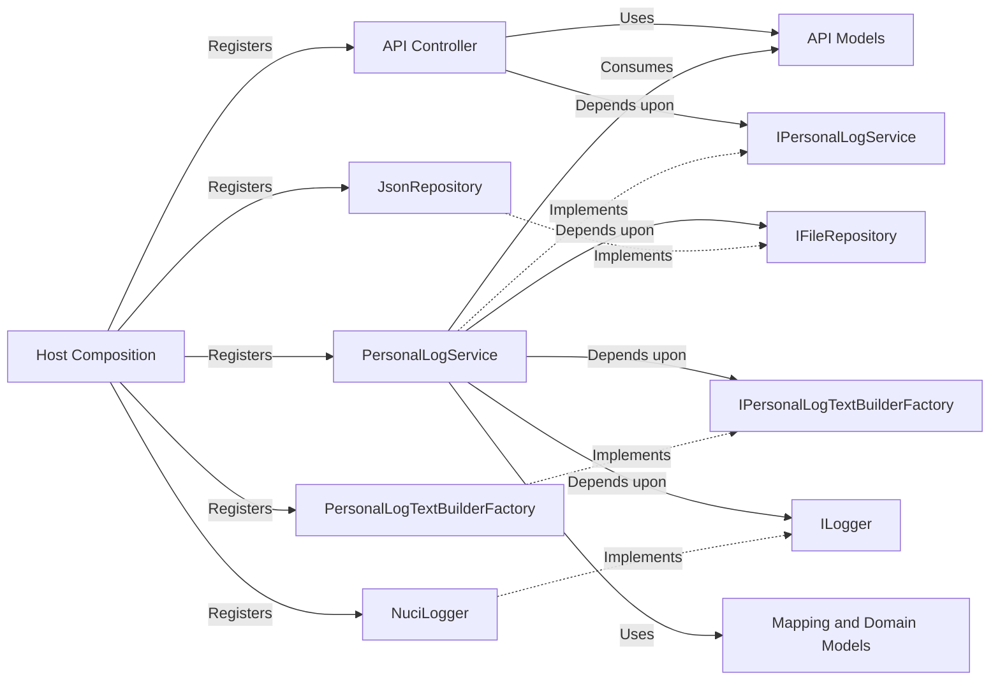

# Personal Log Manager Architecture

This document describes the verified current architecture of the Personal Log Manager runtime, from HTTP ingress through service orchestration, localised text rendering, and file persistence. Delivery infrastructure and client implementations are external to this scope.

## 📑 Table of Contents

- [Table of Contents](#table-of-contents)
- [Purpose](#purpose)
- [System Context](#system-context)
- [Architectural Style](#architectural-style)
- [Runtime Flow](#runtime-flow)
- [Components](#components)
- [Data Architecture](#data-architecture)
- [Interfaces and Integrations](#interfaces-and-integrations)
- [Key Flows](#key-flows)
  - [Store a Log](#store-a-log)
  - [Query Logs](#query-logs)
  - [Retrieve, Update, or Delete a Log](#retrieve-update-or-delete-a-log)
- [Query and Rendering Semantics](#query-and-rendering-semantics)
- [Cross-Cutting Concerns](#cross-cutting-concerns)
  - [Security and Privacy](#security-and-privacy)
  - [Error Handling](#error-handling)
  - [Observability](#observability)
  - [Configuration](#configuration)
  - [Concurrency and Resource Use](#concurrency-and-resource-use)
- [Dependency Direction and Rules](#dependency-direction-and-rules)
- [External Dependencies](#external-dependencies)
- [Deployment and Operations](#deployment-and-operations)
- [Compatibility Contracts](#compatibility-contracts)
- [Testing and Verification](#testing-and-verification)
- [Design Constraints](#design-constraints)
- [Extension Points](#extension-points)
  - [Log Templates](#log-templates)
  - [Localisations](#localisations)
  - [Persistence Adapters](#persistence-adapters)
- [Source Map](#source-map)
- [Related Documentation](#related-documentation)

## 🎯 Purpose

Personal Log Manager is an ASP.NET Core REST API that stores structured personal activity records and returns either structured records or localised natural-language text. This document records the system boundary, runtime ownership, dependency rules, data contracts, and operational constraints for contributors who modify the host, API, application service, persistence adapter, or text-building domain.

The document describes implemented current state. It does not propose a distributed data service, separate frontend, background processing topology, or target migration.

## 🌐 System Context

The system boundary is one Personal Log Manager process. API clients initiate requests with an API key. The process obtains settings from ASP.NET Core configuration providers, owns mutations to the configured JSON store, and emits operational events through NuciLog. Inbound request data crosses an untrusted network boundary; the store, configuration sources, and log destination cross the process-to-filesystem boundary.



The principal external boundaries are:
- **API Client:** Owns request construction and credential presentation, and receives HTTP results from the controller boundary.
- **Configuration Providers:** Supply the data-store path, authorisation secret, and logger settings through the default ASP.NET Core configuration pipeline.
- **Host Filesystem:** Stores the JSON records and configured logger output; deployment operators own access permissions, persistence, and backups.
- **Nuci Libraries:** Supply request processing, middleware, repository, logging, normalisation, and obfuscation contracts within the process; their internal guarantees remain package-owned.

## 🏗️ Architectural Style

The repository implements a single-deployment layered monolith. ASP.NET Core owns hosting and transport, the API controller delegates use cases to one application-service contract, the service coordinates persistence and rendering, and adapters supplied through dependency injection isolate JSON storage, logging, and text utilities. Localised rendering combines a factory with language-specific builders, while persistence follows a repository abstraction.

This structure centralises use-case ordering in `PersonalLogService`. It permits adapter substitution at the composition root, but the service currently shares request and response models with the API layer.



The principal architecture boundaries are:
- **Hosting and Transport:** Composes the process, middleware, CORS policy, routing, request processing, and authorisation; it may depend upon the application-service contract.
- **Application Service:** Owns use-case orchestration, identifiers, filtering, ordering, mutations, repository commits, and operation logging.
- **Domain and Text Building:** Owns typed log representation, persistence mapping, language selection, template dispatch, deobfuscation, and sentence formation.
- **Persistence:** Owns entity storage behind `IFileRepository<PersonalLogEntity>` and must not expose JSON mechanics to the controller.
- **Cross-Cutting Infrastructure:** Supplies exception translation, scanner protection, request logging, operation logging, sentence normalisation, and value deobfuscation.

## 🔄 Runtime Flow



The principal runtime sequence is:
1. [Program.cs](PersonalLogManager/Program.cs) constructs the default ASP.NET Core host and selects [Startup.cs](PersonalLogManager/Startup.cs).
2. `Startup.ConfigureServices` registers controllers, CORS, bound configuration, NuciAPI protection, and application services.
3. `Startup.Configure` resolves `DataStoreSettings`, creates the configured store when absent, and composes middleware in exception-handling, scanner-protection, request-logging, development diagnostics, HTTPS redirection, CORS, static-file, routing, authorisation, and endpoint order.
4. Attribute routing selects [PersonalLogController.cs](PersonalLogManager/Api/Controllers/PersonalLogController.cs), whose inherited `ProcessRequest` receives the request, operation delegate, and API-key policy.
5. `PersonalLogService` executes the use case synchronously, records operation state, and coordinates repository or text-rendering collaborators.
6. Successful mutations call `SaveChanges`; failures are logged and rethrown to the exception-handling middleware.
7. The middleware pipeline returns the resulting HTTP response to the client.

## 🧩 Components

| Component | Responsibility | Principal Dependencies | Lifetime or Ownership |
|-----------|----------------|------------------------|-----------------------|
| `Program` and `Startup` | Construct the host, register services, initialise the store, and compose middleware | ASP.NET Core, configuration, service-registration extensions | Host-owned for process startup and composition |
| NuciAPI middleware | Translate exceptions, apply scanner protection, and record requests | ASP.NET Core pipeline, NuciAPI middleware packages | One configured process pipeline |
| `PersonalLogController` | Expose `/PersonalLog`, bind route and request models, apply API-key policy, and delegate use cases | `IPersonalLogService`, `SecuritySettings`, `NuciApiController` | Activated by ASP.NET Core for requests |
| `PersonalLogService` | Coordinate create, query, retrieve, update, and delete operations | Repository, text-builder factory, logger, mapping extensions, API models | Singleton registered by the composition root |
| `JsonRepository<PersonalLogEntity>` | Implement identifier lookup, enumeration, mutation, and explicit persistence | NuciDAL, `DataStoreSettings.LogStorePath`, host filesystem | Singleton registered as `IFileRepository<PersonalLogEntity>` |
| `PersonalLogTextBuilderFactory` | Select a language builder, dispatch by template, format the prefix, and normalise output | NuciText normaliser and obfuscator, concrete builders | Singleton factory; concrete builders are created per rendering invocation |
| `PersonalLogMappingExtensions` | Convert string-based entities into typed domain models and vice versa | `PersonalLogEntity`, `PersonalLog`, `PersonalLogTemplate` | Static mapping code |
| `EnglishTextBuilder` and `RomanianTextBuilder` | Produce language-specific text for each template | `PersonalLogTextBuilderBase`, NuciText obfuscator | Created by the factory for a rendering invocation |
| `NuciLogger` | Record service operation lifecycle events | NuciLog settings and output destination | Singleton registered as `ILogger` |

## 💾 Data Architecture

API request models originate at the transport boundary. The application service converts store commands directly into `PersonalLogEntity` values and persists them through the repository. Query rendering maps entities into the typed `PersonalLog` model, then converts them into localised strings. Identifier retrieval maps an entity directly into a structured response model.

The JSON repository is the authoritative application store. Each mutation invokes `SaveChanges`, but transaction, locking, atomic-write, and cross-process consistency guarantees are defined by the external NuciDAL implementation rather than this repository. The application defines no cache, schema migration, automatic retention, or repair process.



| Data or Store | Owner | Representation and Storage | Lifecycle or Consistency |
|---------------|-------|----------------------------|--------------------------|
| API request and response models | API controller and application service | In-memory DTOs in [Api/Models](PersonalLogManager/Api/Models) | Created per request; scalar updates use null to indicate no modification |
| `PersonalLogEntity` | Application service and repository | String-based entity with arbitrary `Dictionary<string, string>` data | Created, mutated, or removed by service operations; persisted after `SaveChanges` |
| `PersonalLog` | Text-building domain | In-memory typed model using `DateOnly`, `TimeOnly`, and `PersonalLogTemplate` | Created from an entity for rendering and not persisted directly |
| JSON log store | `JsonRepository<PersonalLogEntity>` | JSON file at `dataStoreSettings.logStorePath`; default [logs.json](PersonalLogManager/Data/logs.json) | Created as `[]` when absent; retained until explicit deletion or operator action |
| Operational log output | `NuciLogger` | Destination configured by `nuciLoggerSettings`; file output is enabled by default | Package-owned write semantics and operator-owned retention |

## 🔌 Interfaces and Integrations

| Interface or Integration | Direction | Contract | Owner | Failure Semantics |
|--------------------------|-----------|----------|-------|-------------------|
| Personal Log REST API | Inbound | ASP.NET Core HTTP routes under `/PersonalLog` with request and response DTOs | `PersonalLogController` | `ProcessRequest` applies authorisation; service failures propagate to NuciAPI exception middleware |
| ASP.NET Core configuration | Inbound | Default host providers bound to `DataStoreSettings`, `SecuritySettings`, and NuciLog settings | `Startup` and `ServiceCollectionExtensions` | Missing or empty store paths fail store initialisation; other package-owned validation is not defined locally |
| JSON repository | Bidirectional | `IFileRepository<PersonalLogEntity>` with explicit `SaveChanges` | `PersonalLogService` through NuciDAL adapter | Exceptions inside service operation `try` blocks are logged and rethrown; no retry or fallback is defined |
| NuciLog output | Outbound | Structured operation events through `ILogger` | `PersonalLogService` and `NuciLogger` | Destination and failure conduct are package-owned and not specialised in this repository |

The REST resource exposes these operations:

| Method | Route | Service Operation |
|--------|-------|-------------------|
| `POST` | `/PersonalLog` | Store a log |
| `GET` | `/PersonalLog` | Query and render logs |
| `GET` | `/PersonalLog/{id}` | Retrieve one structured log |
| `PUT` | `/PersonalLog/{id}` | Update a log |
| `DELETE` | `/PersonalLog/{id}` | Delete a log |

## 🔀 Key Flows

### Store a Log



The service generates an identifier in the `L#########` format and verifies that it is absent from the repository before insertion. It persists request values with an ISO 8601 UTC creation timestamp. Identifier checking and insertion are separate operations, so the repository contract does not establish an atomic uniqueness guarantee across concurrent processes. The presence check occurs before the store operation's persistence `try` block; a failure during that check propagates without a service-level failure event.

### Query Logs



The service loads all entities before filtering. It orders matching values by date descending, time descending, template ascending, and creation timestamp ascending, then applies the requested count. Rendering failures identify the last entity under construction, are logged by the service, and propagate to exception middleware.

### Retrieve, Update, or Delete a Log



Retrieval returns persisted values through `GetLogByIdResponse`. Update semantics preserve omitted scalar values, merge supplied dictionary keys, and assign an ISO 8601 UTC update timestamp. Delete removes the identified entity. Repository errors follow the shared log-and-rethrow path.

## ⚙️ Query and Rendering Semantics

Date, time, and template filters are interpreted as case-sensitive regular expressions. The service adds start and end anchors when the caller omits them. Data filters use the same anchoring policy with case-insensitive matching and require every supplied key-value pair to match. Invalid or computationally expensive patterns are not separately constrained in repository code and fail or consume resources at query execution.

[PersonalLogTextBuilderFactory.cs](PersonalLogManager/Service/TextBuilding/PersonalLogTextBuilderFactory.cs) renders selected records in this order:
1. Construct a prefix from date and optional time and time zone.
2. Select `RomanianTextBuilder` for `ro`, `ro-RO`, or `ro-MD`; select `EnglishTextBuilder` for every other localisation value.
3. Derive the public method name `Build{Template}LogText` from `PersonalLogTemplate`.
4. Invoke that method on the selected builder through reflection.
5. Normalise the complete sentence through NuciText.

[PersonalLogTextBuilderBase.cs](PersonalLogManager/Service/TextBuilding/PersonalLogTextBuilderBase.cs) owns shared extraction, deobfuscation, numeric formatting, pluralisation, and value mapping. `GetDecimalValue` parses and formats with the current process culture, then removes only a `.00` suffix, so numeric rendering differs under comma-decimal cultures. The reflection convention is a runtime compatibility contract: each renderable template requires a correspondingly named public method on every supported language builder.

## 🧵 Cross-Cutting Concerns

### Security and Privacy

Every controller action supplies an API-key authorisation policy to `NuciApiController.ProcessRequest`. The key is bound from `securitySettings.apiKey`; the committed configuration contains a substitution token rather than a deployable secret. Deployments must inject the genuine value outside source control.

Scanner protection precedes routing, HTTP requests pass through HTTPS-redirection middleware, and CORS permits only the explicit localhost origins in `Startup`. Request content remains untrusted at ingress. The JSON store and operational logs can contain personal information or personal metadata; this repository configures no at-rest protection, so filesystem permissions, secret management, backup protection, and retention remain operator responsibilities.

### Error Handling

NuciAPI exception-handling middleware is the outermost application middleware. `PersonalLogService` records failures caught within its operation bodies and rethrows them rather than translating HTTP responses. Exact status and response translation remain owned by the middleware package.

Text-rendering errors are wrapped in `InvalidOperationException` with the last processed log identifier. Repository, parsing, reflection, and regular-expression errors terminate the current operation; no retry, fallback, partial response, or degradation policy is defined. Store-initialisation failures propagate during startup and prevent normal host activation.

### Observability

NuciAPI request-logging middleware records HTTP activity. `PersonalLogService` emits started and successful operation events through `ILogger`, plus failure events for exceptions caught within operation bodies. Context includes identifiers, dates, times, templates, localisation values, and counts. NuciLog controls the destination and file-output conduct through configuration.

The repository defines no metrics, distributed traces, health endpoint, or explicit correlation contract. Because operation context can identify personal activity, access to logger output requires the same privacy discipline as access to the primary store.

### Configuration

| Configuration Area | Source | Responsibility | Override or Secret Policy |
|--------------------|--------|----------------|---------------------------|
| `dataStoreSettings` | [appsettings.json](PersonalLogManager/appsettings.json) and default ASP.NET Core providers | Select the JSON repository path | Environment-specific files, environment variables, and command-line values can override the committed default |
| `securitySettings` | [appsettings.json](PersonalLogManager/appsettings.json) and default ASP.NET Core providers | Supply the API-key authorisation value | The committed token is not a secret; inject the genuine value through protected deployment configuration |
| `nuciLoggerSettings` | [appsettings.json](PersonalLogManager/appsettings.json) and NuciLog configuration binding | Select logging destinations and options | Default host configuration precedence applies; protect destinations that contain personal metadata |
| Process culture | Host environment and .NET runtime defaults | Controls decimal parsing and formatting in the shared text builder | No application setting normalises culture; deployment and test-runner cultures can produce different text |

### Concurrency and Resource Use

The repository, application service, text-builder factory, text utilities, and logger are registered as singletons. Controller operations and file-repository calls are synchronous. Repository-owned code contains no explicit synchronisation, queue, backpressure mechanism, or request-level resource bound; effective thread and cross-process safety depends partly upon the external repository and logger implementations.

Queries call `GetAll` and then filter, order, and limit in application memory. Their processing and allocation costs therefore increase with total stored records, even when the requested response count is minor. The singleton service also shares its identifier generator across requests.

## 🧭 Dependency Direction and Rules

Transport depends upon the application-service interface. The service implementation depends upon repository, text-building, and logging abstractions, while the composition root selects concrete adapters. One deliberate current coupling remains: `IPersonalLogService` and `PersonalLogService` accept API request models and return API response models directly.



The principal dependency rules are:
- Controllers may invoke `IPersonalLogService` but must not access the file repository or concrete text builders directly.
- `PersonalLogService` owns operation ordering and every repository `SaveChanges` boundary.
- Persistence access must pass through `IFileRepository<PersonalLogEntity>`; JSON path and serialisation mechanics remain adapter concerns.
- Text rendering must pass through `IPersonalLogTextBuilderFactory`; the service must not select language builders or invoke template methods itself.
- Mapping may depend upon persistence and domain models, but localised builders must not depend upon controllers or repository implementations.
- Concrete adapter selection and singleton lifetimes belong to [ServiceCollectionExtensions.cs](PersonalLogManager/ServiceCollectionExtensions.cs), not to use-case code.

## 📦 External Dependencies

| Dependency | Responsibility | Integration Boundary | Architectural Consequence |
|------------|----------------|----------------------|---------------------------|
| ASP.NET Core | Hosting, dependency injection, configuration, middleware, CORS, routing, controllers, and static-file support | `Program`, `Startup`, and `PersonalLogController` | Defines the process and HTTP lifecycle; the project targets .NET 10 |
| NuciAPI | Controller request processing and API-key authorisation | `PersonalLogController` | Public request and failure conduct depends upon package contracts |
| NuciAPI middleware | Exception translation, scanner protection, and request logging | `Startup.Configure` | Middleware order is consequential to security, diagnostics, and failure responses |
| NuciDAL | Entity base, file-repository abstraction, and JSON repository | `PersonalLogEntity` and dependency-injection registration | Persistence semantics and concurrency guarantees are partly package-owned |
| NuciLog | Structured operation logging | `PersonalLogService` and `ServiceCollectionExtensions` | Logger destination and write-failure conduct are externally implemented |
| NuciText | Sentence normalisation and value deobfuscation | `PersonalLogTextBuilderFactory` and localised builders | Rendered text semantics depend upon normaliser and obfuscator compatibility |

Package versions are defined in [PersonalLogManager.csproj](PersonalLogManager/PersonalLogManager.csproj).

## 🚀 Deployment and Operations

The deployment unit is one .NET 10 ASP.NET Core process. It requires network access for its HTTP endpoint and read-write access to the configured JSON store and logger destination. On startup, the process creates the store directory when necessary and initialises a missing store with `[]`. ASP.NET Core's default host owns process startup and shutdown; the repository adds no specialised shutdown sequence.

Persistent state resides on the host filesystem. The repository contains no database server, cache, queue, worker process, container topology, replication protocol, or cross-instance coordination. Multiple processes writing one store are therefore not a verified deployment configuration.

| Concern | Current Design | Architectural Consequence |
|---------|----------------|---------------------------|
| Process topology | One ASP.NET Core process | All API, service, rendering, persistence, and logging responsibilities share one failure and scaling unit |
| Persistent state | Configured JSON file, with [logs.json](PersonalLogManager/Data/logs.json) as the default | Operators must preserve filesystem state and control permissions, backups, retention, and restoration |
| Startup | Store directory and empty file are created before request handling | Invalid paths or filesystem failures prevent normal activation |
| Scaling | No repository-owned cross-process coordination or server-side query engine | Horizontal writers and high-volume stores are not verified; full scans remain process-local |
| Availability and recovery | No replication, migration, repair, or recovery workflow is implemented | Availability and restoration depend upon host and backup procedures |
| Operator output | ASP.NET Core console output and configured NuciLog destination | Diagnostics are available through logs, but no health or metrics interface is present |

## 🛡️ Compatibility Contracts

| Contract | Owner | Invariant | Verification | Change Policy |
|----------|-------|-----------|--------------|---------------|
| Personal Log REST resource | `PersonalLogController` | Methods and routes remain `POST /PersonalLog`, `GET /PersonalLog`, and `GET`, `PUT`, or `DELETE /PersonalLog/{id}` | Controller source review; no automated host-level integration suite is present | Coordinate incompatible route or DTO revisions with clients |
| Log identifier | `PersonalLogService` | Newly stored identifiers use `L` followed by nine decimal digits and are checked for repository presence | Service unit tests and source review | Preserve accepted identifiers; migrate clients and stored references before format changes |
| Persisted log entity | `PersonalLogEntity`, mapping, and NuciDAL adapter | Existing date, optional time, template, timestamp, and data values remain parseable by mapping and rendering code | Unit coverage for service and rendering; concrete serialisation lacks dedicated integration coverage | Provide migration or backward-compatible parsing before incompatible schema changes |
| Template dispatch | `PersonalLogTextBuilderFactory` and localised builders | Every renderable `PersonalLogTemplate` has a public `Build{Template}LogText` method on each supported builder | Factory and language-builder unit tests | Add all builder methods and tests in the same revision as an enumeration value |
| Localisation selection | `PersonalLogTextBuilderFactory` | `ro`, `ro-RO`, and `ro-MD` select Romanian; other values select English | Factory unit tests | Preserve existing locale meanings when adding selectors |
| Partial update semantics | `PersonalLogService` | Omitted scalar fields remain intact and supplied data keys merge into the existing dictionary | Service unit tests | Treat replacement or key-removal semantics as an API contract revision |

## ✅ Testing and Verification

[PersonalLogManager.UnitTests](PersonalLogManager.UnitTests) mirrors the service and text-building structure. Service tests verify use-case orchestration with collaborators; text-building tests verify shared helpers, factory selection and formatting, and English and Romanian template rendering. The automated suite compiles both projects but does not activate an HTTP host or exercise the concrete JSON repository through the filesystem.

Controller routing, model binding, API-key rejection, middleware order, serialisation, filesystem failure conduct, and deployed configuration require manual verification or future integration tests. The suite does not fix or parameterise `CurrentCulture`; decimal-helper tests pass under a dot-decimal culture and fail under a comma-decimal culture. Architecture revisions that affect these boundaries must not infer coverage from service mocks or one process culture alone.

Execute the principal automated verification with:

```bash
dotnet test PersonalLogManager.slnx
```

## ⚠️ Design Constraints

- **File-Backed Persistence:** Every query begins with `GetAll`, then filters and orders in process memory; processing cost increases with total store size and no server-side index exists.
- **Unverified Multi-Process Consistency:** Identifier checks and writes are separate operations, and repository-owned code defines no cross-process lock or transaction policy.
- **Singleton Collaborators:** The service, repository, factory, text utilities, and logger are shared across requests; replacements must tolerate the effective concurrency of the ASP.NET Core host.
- **Synchronous Request Path:** Repository access, filtering, rendering, and logging occur on the request path without queueing or asynchronous application methods.
- **Regular-Expression Input:** Query filters are executable regular-expression patterns; invalid or expensive expressions can fail or delay an operation.
- **Process-Culture Decimal Semantics:** Decimal parsing and formatting use `CurrentCulture`, while suffix removal assumes a full stop decimal separator; rendered values and tests vary between dot-decimal and comma-decimal environments.
- **Reflection Dispatch:** Template-to-builder method correspondence is checked at runtime rather than compilation time.
- **Strict Persisted Formats:** Rendering parses dates, timestamps, and template names from stored strings; malformed or obsolete records can fail an entire query.
- **No Schema Lifecycle:** The application defines no migration, repair, expiry, archival, or automatic backup process for the JSON store.
- **Shared Transport Models:** The application-service contract depends directly upon API DTOs, so transport-model revisions can affect service callers and tests.
- **Sensitive Local State:** Personal records and operation metadata reside in operator-managed files without repository-owned at-rest protection.

## 🔧 Extension Points

### Log Templates

1. Add the enumeration value to [PersonalLogTemplate.cs](PersonalLogManager/Service/Models/PersonalLogTemplate.cs).
2. Add the corresponding `Build{Template}LogText` method to both localised builders and reuse or extend shared base helpers.
3. Add factory, English, and Romanian tests that exercise the new template.

The public method name must correspond exactly to the enumeration value because the factory uses reflection. Every supported localisation must implement the template before stored records use it.

### Localisations

1. Implement a language-specific builder derived from `PersonalLogTextBuilderBase`.
2. Integrate its accepted locale codes in `PersonalLogTextBuilderFactory.GetTextBuilder` and preserve the existing English fallback.
3. Add selection, formatting, and complete template coverage for the localisation.

Builders are created directly by the singleton factory rather than dependency injection. A new builder must preserve the public reflection-method convention and remain compatible with shared deobfuscation and normalisation.

### Persistence Adapters

1. Implement or adapt the `IFileRepository<PersonalLogEntity>` contract expected by `PersonalLogService`.
2. Register the implementation in [ServiceCollectionExtensions.cs](PersonalLogManager/ServiceCollectionExtensions.cs) with a lifetime compatible with the singleton service.
3. Add integration verification for identifier lookup, enumeration, mutation, `SaveChanges`, concurrency, and failure propagation.

The adapter must preserve explicit commit semantics and the persisted values required by `PersonalLogMappingExtensions`. Non-file persistence would require a deliberate contract change because the current port is `IFileRepository`.

## 🗺️ Source Map

| Area | Path |
|------|------|
| Host entry point | [PersonalLogManager/Program.cs](PersonalLogManager/Program.cs) |
| Startup and middleware | [PersonalLogManager/Startup.cs](PersonalLogManager/Startup.cs) |
| Dependency-injection composition | [PersonalLogManager/ServiceCollectionExtensions.cs](PersonalLogManager/ServiceCollectionExtensions.cs) |
| API controller | [PersonalLogManager/Api/Controllers/PersonalLogController.cs](PersonalLogManager/Api/Controllers/PersonalLogController.cs) |
| API contracts | [PersonalLogManager/Api/Models](PersonalLogManager/Api/Models) |
| Application-service contract and implementation | [PersonalLogManager/Service](PersonalLogManager/Service) |
| Domain and persistence mapping | [PersonalLogManager/Service/Mapping](PersonalLogManager/Service/Mapping) |
| Localised text building | [PersonalLogManager/Service/TextBuilding](PersonalLogManager/Service/TextBuilding) |
| Persistence entity | [PersonalLogManager/DataAccess/DataObjects/PersonalLogEntity.cs](PersonalLogManager/DataAccess/DataObjects/PersonalLogEntity.cs) |
| Runtime configuration | [PersonalLogManager/appsettings.json](PersonalLogManager/appsettings.json) |
| Automated tests | [PersonalLogManager.UnitTests](PersonalLogManager.UnitTests) |
| Project dependencies | [PersonalLogManager/PersonalLogManager.csproj](PersonalLogManager/PersonalLogManager.csproj) |

## 📚 Related Documentation

- [README.md](README.md) defines installation, configuration, API usage, development, and release guidance that complements these architectural boundaries.