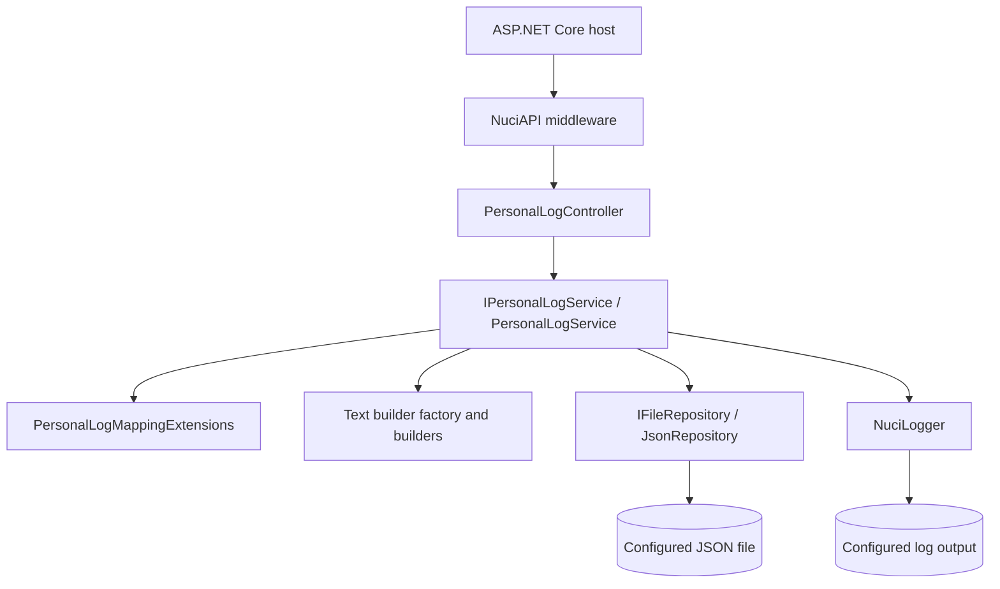
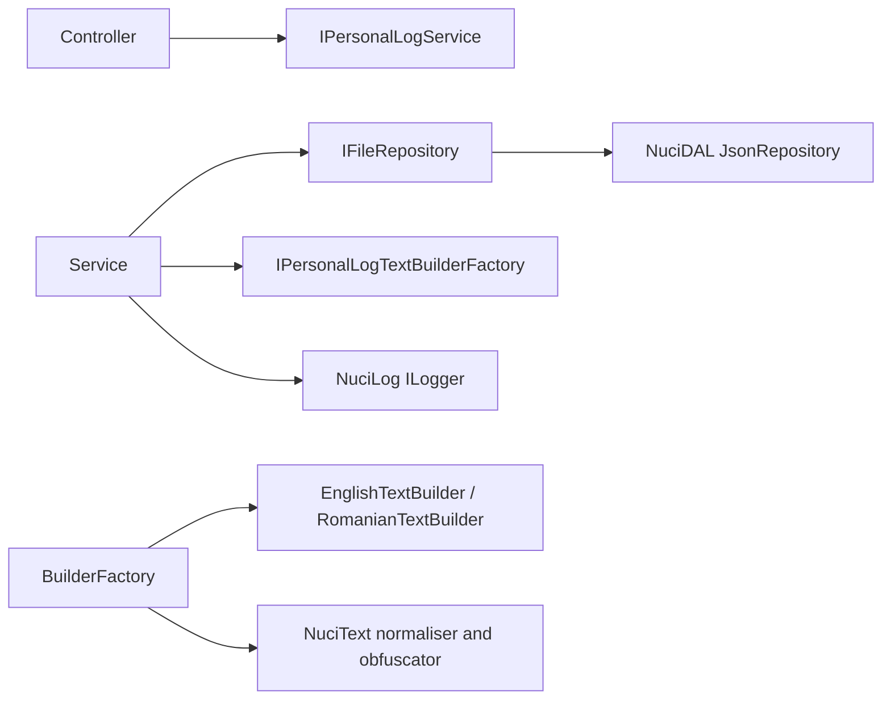

# Architecture

## Metadata
- Purpose: Describe the implementation architecture, ownership boundaries, and runtime topology.
- Scope: Projects, layers, dependency direction, composition, and process boundaries.
- Primary source areas: `Program.cs`, `Startup.cs`, `ServiceCollectionExtensions.cs`, controller, service, repository registration, text-building and mapping directories.
- Related documents: [Repository Overview](repository-overview.md), [Components](components/api.md), [Startup Flow](flows/startup.md), [Design Decisions](design-decisions.md).

## Architectural Style
The repository is a single-deployment layered monolith. ASP.NET Core provides hosting and transport. The API layer binds HTTP data and delegates to one application-service contract. `PersonalLogService` owns use-case sequencing. Mapping and text-building code translate persisted records into typed domain values and localised sentences. A NuciDAL repository adapter hides JSON mechanics from the service.

## Projects

| Project | Runtime role | Dependency direction |
|---------|--------------|----------------------|
| `PersonalLogManager` | Executable web API, application service, persistence entity, text builders, configuration | Depends on Nuci packages |
| `PersonalLogManager.UnitTests` | NUnit tests for service and text-building behaviour | References application project |
| `PersonalLogManager.IntegrationTests` | HTTP-level tests using `WebApplicationFactory<Program>` | References application project and ASP.NET Core test host |

The solution file is `PersonalLogManager.slnx`. The application targets `net10.0` and uses the Web SDK.

## Composition Root
`Startup.ConfigureServices` calls `AddConfigurations`, `AddNuciApiScannerProtection`, and `AddCustomServices`. `ServiceCollectionExtensions` binds `dataStoreSettings` and `securitySettings` into singleton settings objects and adds Nuci logger settings. It registers the JSON repository, text-builder factory, application service, text normaliser, text obfuscator, and logger as singletons.

The composition root therefore determines several important lifetimes:

- `PersonalLogService` is a singleton and contains a mutable `Random` instance.
- `JsonRepository<PersonalLogEntity>` is a singleton and owns the repository abstraction instance.
- `PersonalLogTextBuilderFactory`, normaliser, obfuscator, and logger are singletons.
- Concrete English and Romanian builders are instantiated by the factory for each rendering operation.
- Controllers are created by ASP.NET Core per its MVC controller activation rules.

## Component Responsibilities

### Hosting And Middleware
`Program` and `Startup` create the host, bind configuration, initialise the store, configure CORS, and order middleware. They do not implement log use cases.

NuciAPI middleware performs package-owned exception handling, scanner protection, and request logging. The repository also enables development exception pages, HTTPS redirection, CORS, static files, routing, and authorisation.

### API Transport
`PersonalLogController` exposes five routes, constructs route-aware request DTOs, supplies `SecuritySettings.ApiKey` to `NuciApiAuthorisation.ApiKey`, and delegates to `IPersonalLogService`. It does not query the repository or render text.

### Application Service
`PersonalLogService` is the use-case coordinator. It generates identifiers, creates persistence entities, applies regex filters, orders and limits query results, maps entities, calls text builders, applies partial updates, saves mutations, and records operation events. It does not own HTTP routing or JSON serialisation.

### Mapping And Rendering
`PersonalLogMappingExtensions` converts between string-based entities and typed `PersonalLog` values. `PersonalLogTextBuilderFactory` chooses a language, builds the date/time prefix, selects a `Build{Template}LogText` method through reflection, normalises the sentence, and returns it. Localisation builders contain template-specific prose and language-specific helper implementations.

### Persistence
`JsonRepository<PersonalLogEntity>` is supplied by NuciDAL and registered behind `IFileRepository<PersonalLogEntity>`. The application controls the path and explicit `SaveChanges` calls, but repository serialisation, file replacement, locking, and exception details are package-owned.

## Dependency Direction
Dependencies point inward from transport to the application service, and from the service to abstractions and focused adapters:

The service receives collaborators through constructor injection. There is no service locator inside use-case code. The one explicit service-provider lookup occurs during startup to obtain `DataStoreSettings` for store creation.

## Runtime And Network Topology
The application is one process with an HTTP boundary and filesystem boundaries. Clients connect to ASP.NET Core. The process reads configuration, reads and writes the JSON store, and optionally writes an operational log file. There is no internal network call or process-to-process protocol.

## Initialisation And Shutdown
Initialisation occurs during host startup and `Startup.Configure`. The configured store path is validated for non-whitespace, its parent directory is created when necessary, and a missing file is initialised with `[]`. Nuci and ASP.NET Core own middleware and host disposal. The application defines no explicit shutdown hook, flush routine, or repository disposal path.

## Failure Boundaries
Controller and service exceptions propagate into NuciAPI exception-handling middleware. Service operations log failures and rethrow. Query text construction wraps a rendering failure in `InvalidOperationException` with the last processed identifier. Configuration and store initialisation failures occur during startup. See [Error Handling](error-handling.md).
