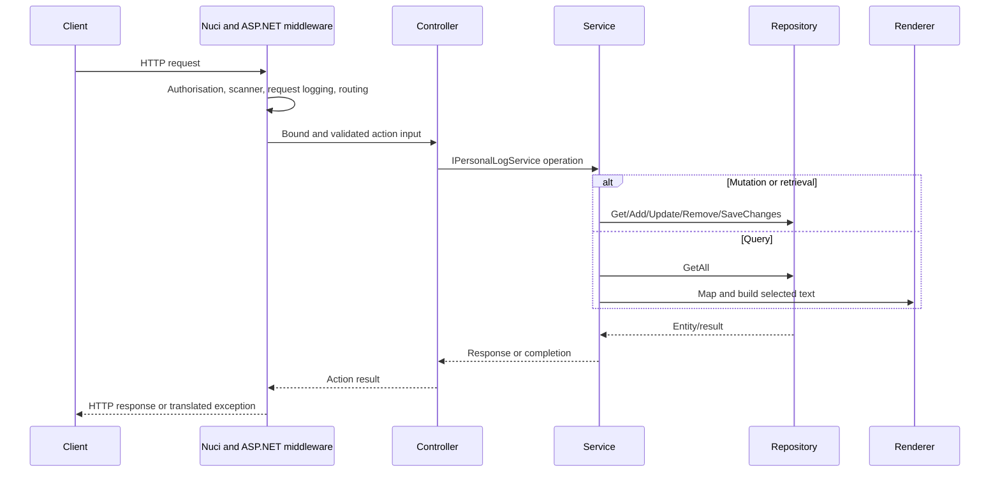

# HTTP Request Flow

## Metadata
- Purpose: Trace an HTTP operation from ingress through controller, service, persistence/rendering, and response.
- Scope: Common middleware path and operation-specific branches.
- Primary source areas: `Startup.cs`, `PersonalLogController.cs`, `PersonalLogService.cs`, API models, Nuci middleware registrations.
- Related documents: [API Component](../components/api.md), [Log Capability](../behaviour/log-capability.md), [Error Handling](../error-handling.md), [Security](../security.md).

## Common Sequence

## Branches
Create performs id generation, add, and save. Query performs all-record loading, filtering, ordering, limiting, mapping, and rendering. Retrieve copies one entity into a structured response. Update forces the route id, merges changes, and saves. Delete removes and saves.

Missing or invalid credentials terminate at authorisation. Model validation terminates before service execution. Service, repository, regex, mapping, and builder failures propagate to Nuci exception middleware. The controller does not add recovery or domain-specific status conversion.

## Data At Boundaries
HTTP input is a request DTO. Mutations become `PersonalLogEntity`. Query rendering converts selected entities into `PersonalLog`, then localised text. Structured retrieval remains string-based. JSON persistence and logger output are side effects outside the HTTP response body.
