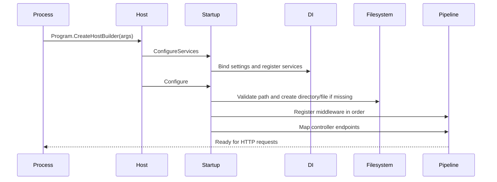

# Startup Flow

## Metadata
- Purpose: Trace executable initialisation from process entry to request readiness.
- Scope: Host construction, configuration binding, registrations, store creation, middleware, and endpoint mapping.
- Primary source areas: `Program.cs`, `Startup.cs`, `ServiceCollectionExtensions.cs`, `appsettings.json`.
- Related documents: [Application Lifecycle](../behaviour/application-lifecycle.md), [Architecture](../architecture.md), [Configuration](../configuration.md).

## Sequence

1. `Program.Main` constructs and runs the default host using `Startup`.
2. ASP.NET Core invokes `ConfigureServices`.
3. `AddConfigurations` binds `dataStoreSettings` and `securitySettings`; Nuci logger settings are added.
4. Nuci scanner protection and custom singleton services are registered.
5. `Configure` resolves `DataStoreSettings` from the service provider.
6. `CreateStoreIfMissing` rejects a blank path, creates the parent directory if necessary, and writes `[]` if the store file is absent.
7. Middleware is appended: Nuci exception handling, scanner protection, request logging, development exception page when applicable, HTTPS redirection, CORS, default/static files, routing, authorisation, and endpoint mapping.
8. Requests can now reach `PersonalLogController`.

A path/configuration/filesystem failure before step 7 prevents normal startup. There is no startup migration or data validation branch.
